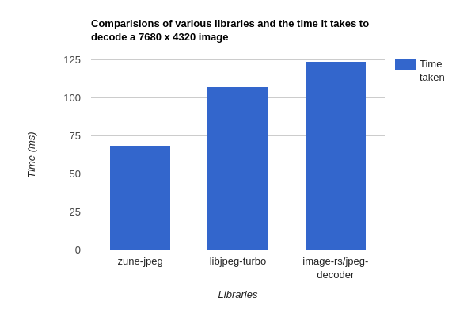

# Zune-jpeg

An incredibly spicy jpeg decoder.

# Features

- [x] A Pretty fast 8*8 integer IDCT.
- [x] Fast Huffman Decoding
- [x] Fast color convert functions.
- [x] Support for extended colorspaces like GrayScale and RGBA
- [X] Multi-threaded decoding.

# Crate Features  

| feature  | on   | Capabilities                                                                                |
|----------|------|---------------------------------------------------------------------------------------------|
| `x86`    | ✅    | Enables `x86` specific instructions, specifically `avx` and `sse` for accelerated decoding. |

Note that the `x86` features are automatically disabled on platforms that aren't x86 during compile 
time hence there is no need to disable them explicitly if you are targeting such a platform.

## Debug vs release
The decoder heavily relies on platform specific intrinsics, namely AVX2 and SSE to gain speed-ups in decoding, 
but in debug build rust generally [doesn't like platform specific intrinsics](https://godbolt.org/z/vPq57z13b) (try passing `-O` parameter to see optimized build) hence obviously speeds tank so bad during debug builds, and there is probably nothing
we can do about that.

# The Decoder.

### x86_64 benchmarks

### Apple M1 benchmarks

The decoder is blazingly fast, especially on x86_64 with AVX2 enabled CPU's(most cpu's from 2013).

Even with CPU's that don't support these extensions, the code is carefully written to allow the auto-vectorizer to
accelerate for whatever platforms in mind.

Furthermore, we take advantage of multi-core CPU's to accelerate post-processing of images to bring 1.5x performance edge 
over [libjpeg-turbo] and 2x over [image-rs/jpeg-decoder].

For more up-to-date benchmarks, see [Benches.md](/Benches.md).

Note, we do not try to recover corrupt JPEG's, your best bet is libjpeg-turbo for that, all errors are propagated
up to the caller.

# TODO
- [ ] Add support for Adobe APP14 images.
- [ ] Support more colorspace options. It would not be too bad if we support all color options libjpeg/mozjpeg supports.

[libjpeg-turbo]:https://github.com/libjpeg-turbo/libjpeg-turbo/

[image-rs/jpeg-decoder]:https://github.com/image-rs/jpeg-decoder/tree/master/src